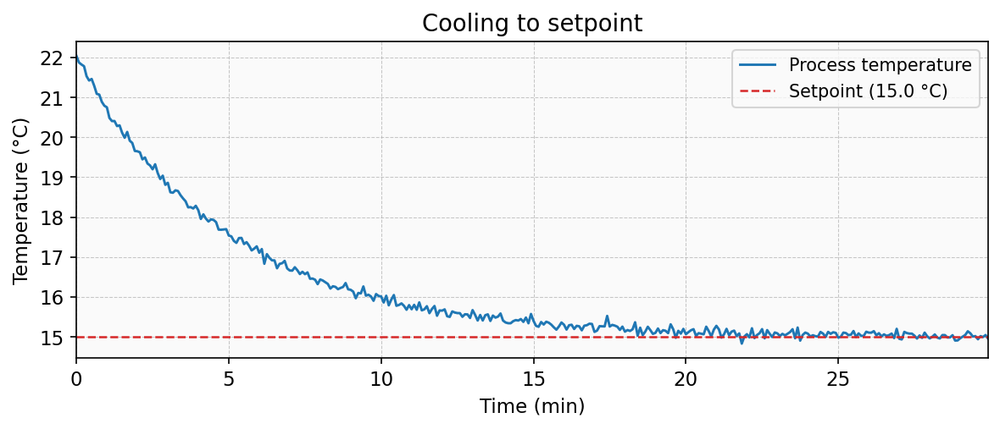
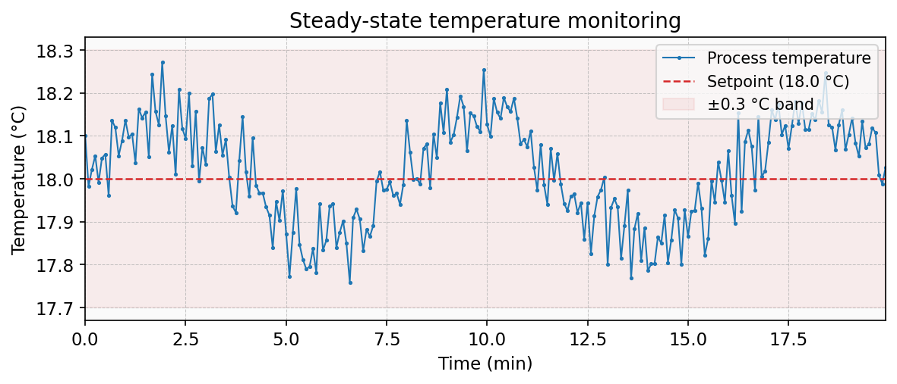
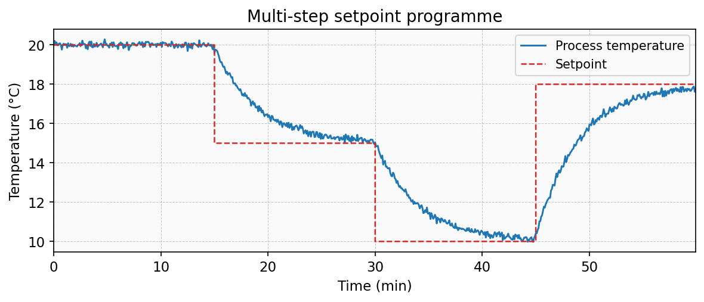

# Julabo Control Suite

Comprehensive utilities for operating a Julabo recirculating chiller from Python.  The
project bundles a reusable library, a command-line interface, a local desktop GUI, and a
small TCP service with a remote GUI client.

## Examples

The built-in GUI records live temperature readings and plots them over time.
Below are example plots generated with simulated data to illustrate typical
usage scenarios.

### Cooling to a setpoint



### Steady-state monitoring



### Multi-step setpoint programme



These plots can be regenerated with `python3 generate_example_plots.py`.

## Compatibility

This control suite was developed specifically for the **Julabo FL1703** recirculating
chiller. However, it can be easily adapted to work with other Julabo models that use the
same serial communication protocol (ASCII-based commands over RS232 with 4800 baud, 7
data bits, even parity, 1 stop bit, and RTS/CTS flow control).

If your Julabo model supports the same command set (`in_sp_00`, `out_sp_00`, `in_pv_00`,
`in_mode_05`, `out_mode_05`, etc.), this software should work without modification.
Consult your device's manual to verify protocol compatibility. The included
`Julabo_FL1703_manual.pdf` can serve as a reference for the communication protocol.

## Additional resources

* [Repository on GitHub](https://github.com/EfrenPy/JulaboFL1703-control)
* [TCP JSON Protocol reference](docs/PROTOCOL.md)
* [Deployment guide](docs/DEPLOYMENT.md)
* [Security considerations](docs/SECURITY.md)
* [Troubleshooting](docs/TROUBLESHOOTING.md)

## Project layout

```
Julabo-control/
├── julabo_control/           # Reusable Python package
│   ├── __init__.py           # Public API exports (lazy-loads GUI modules)
│   ├── __main__.py           # Thin wrapper that dispatches to cli.main
│   ├── alarm.py              # Temperature alarm monitoring
│   ├── async_server.py       # Asyncio-based TCP server alternative
│   ├── cli.py                # Command line entrypoint
│   ├── config.py             # INI configuration file loader
│   ├── core.py               # Serial helpers and JulaboChiller implementation
│   ├── db.py                 # SQLite temperature history storage
│   ├── dispatch.py           # Shared command dispatcher for TCP servers
│   ├── gui.py                # Local Tk interface (ChillerApp class)
│   ├── logging_utils.py      # JSON log formatter for structured logging
│   ├── mqtt_bridge.py        # MQTT telemetry bridge
│   ├── notifications.py      # Cross-platform desktop notifications
│   ├── py.typed              # PEP 561 type-checking marker
│   ├── remote_client.py      # Remote GUI client and RemoteChillerClient
│   ├── remote_server.py      # TCP JSON server exposing Julabo commands
│   ├── schedule.py           # Setpoint schedule and ramp runner
│   ├── simulator.py          # FakeChiller backend and PTY serial emulator
│   ├── temperature_logger.py # CSV temperature logger
│   ├── ui.py                 # Shared Tk/matplotlib utilities
│   └── web.py                # Browser-based dashboard (HTTP + WebSocket + Chart.js)
├── docs/                     # Documentation
│   ├── DEPLOYMENT.md         # Deployment guide
│   ├── PROTOCOL.md           # TCP JSON protocol reference
│   ├── SECURITY.md           # Security considerations
│   └── TROUBLESHOOTING.md    # Troubleshooting guide
├── examples/                 # Schedule CSVs, systemd unit, env template
├── monitoring/               # Prometheus and Grafana configuration
├── tests/                    # Test suite (587 tests, 93% coverage)
├── docker-compose.yml        # Server + Prometheus + Grafana stack
├── pyproject.toml            # Build configuration and dependencies
├── Dockerfile                # Container image for the server
├── CHANGELOG.md              # Version history
├── CONTRIBUTING.md           # Contribution guidelines
├── Julabo_FL1703_manual.pdf  # Official user manual (for reference)
└── README.md                 # This guide
```

## Requirements

* Python 3.9+
* [`pyserial`](https://pyserial.readthedocs.io/en/latest/)
* [`matplotlib`](https://matplotlib.org/)
* A Julabo chiller connected through a null-modem cable and an RS232-to-USB adapter

Install the package:

```bash
pip install .
```

Or install with development tools:

```bash
pip install -e .[dev]
```

Optional extras:

```bash
pip install -e .[mqtt]       # MQTT bridge support (paho-mqtt)
pip install -e .[websocket]  # WebSocket support (websockets)
```

## Entry points

| Command              | Module                          | Description                          |
|----------------------|---------------------------------|--------------------------------------|
| `julabo`             | `julabo_control.cli`            | CLI for chiller commands             |
| `julabo-server`      | `julabo_control.remote_server`  | Threaded TCP JSON server             |
| `julabo-server-async`| `julabo_control.async_server`   | Asyncio TCP server alternative       |
| `julabo-remote`      | `julabo_control.remote_client`  | Remote tkinter GUI client            |
| `julabo-web`         | `julabo_control.web`            | Browser-based dashboard              |
| `julabo-simulator`   | `julabo_control.simulator`      | FakeChiller backend for development  |
| `julabo-mqtt`        | `julabo_control.mqtt_bridge`    | MQTT telemetry bridge                |

## Preparing the chiller

1. Switch the Julabo chiller off.
2. Wait at least five seconds.
3. Press **arrow up** and **return** simultaneously and, while holding them, press the
   power button.
4. The display must show `IOn`. If it shows `IOFF`, repeat the previous steps.
5. After a few seconds the display switches to `rOFF`, indicating that remote control is
   active.

## Configuration file

All CLI tools read an optional INI configuration file at `~/.julabo_control.ini`.
Command-line arguments always take priority over values from the config file.

```ini
[serial]
port = /dev/ttyUSB0
timeout = 3.0

[gui]
poll_interval = 10000
alarm_threshold = 1.5
alarm_log = /var/log/julabo_alarm.csv

[server]
host = 0.0.0.0
port = 8765
auth_token = my-secret-token
read_only = false
idle_timeout = 300
audit_log = /var/log/julabo_audit.log
watchdog = true
metrics_port = 9100
log_format = text

[remote]
host = server.local
port = 8765
timeout = 5.0
poll_interval = 5000
auth_token = my-secret-token

[web]
host = localhost
port = 8765
web_host = 0.0.0.0
web_port = 8080

[mqtt]
broker = mqtt.example.com
port = 1883
topic_prefix = julabo
```

## Local tools

### Command line interface

The CLI automatically probes USB serial adapters until it finds the Julabo controller.
This works on Linux (``/dev/ttyUSB0`` style paths) and on Windows (``COM3`` style names).
Run any of the following commands:

```bash
julabo version
julabo get-setpoint
julabo set-setpoint 18.5
julabo start
```

Alternatively, use `python -m julabo_control` in place of `julabo`.

Optional flags:

* `--port /dev/ttyUSB0` -- override the auto-detected device (use `COM3` on Windows)
* `--timeout 5.0` -- change the serial read timeout in seconds

The CLI caches the last working port in `~/.julabo_control_port`, so subsequent runs (and
GUI launches) reuse the stored device automatically.

Supported subcommands:

* `version` -- return the identification string
* `status` -- return the status message (manual section 11.4)
* `get-setpoint` -- read the current setpoint (`in_sp_00`)
* `set-setpoint` -- update the setpoint (`out_sp_00 xxx.x`)
* `get-temperature` -- read the process temperature (`in_pv_00`)
* `start` / `stop` -- toggle remote cooling (`out_mode_05 1`/`0`)
* `send` -- send an arbitrary raw command (for advanced usage)
* `gui` -- launch the desktop interface described below
* `monitor` -- live terminal temperature display (see below)
* `forget-port` -- remove the cached serial port file

### Local GUI

Launch the interface with:

```bash
julabo gui
```

Or equivalently: `python -m julabo_control gui`.

The GUI displays the current setpoint and process temperature, refreshing every five
seconds.  Enter a new setpoint in the input field and press **Apply** to send the update
to the chiller.  A matplotlib chart keeps track of the most recent readings.

If no port is specified the program reuses the cached port or searches connected
adapters until it finds the chiller.

### Temperature logging

Add `--temperature-log /path/to/log.csv` when launching the GUI or the remote client to
automatically record every temperature reading to a CSV file.  Each row contains a UTC
timestamp, elapsed minutes, process temperature, and the current setpoint.

### Setpoint schedules

A schedule is a CSV file with two columns: `elapsed_minutes` and `temperature_c`.
Between steps the setpoint is linearly interpolated. See the `examples/` directory for
sample schedules.

In the local GUI click **Load Schedule** to start a schedule.  The status bar shows
progress and the temperature chart displays the ramp as a dashed green overlay.

Schedules can also be uploaded remotely via the TCP protocol (`load_schedule` command)
or the web dashboard.

### Desktop notifications

Pass `--desktop-notifications` to the GUI or remote client to receive OS-level
notifications when a temperature alarm triggers.  Supported on macOS, Linux
(notify-send), and Windows (toast notifications).

### Keyboard shortcuts

| Shortcut | Action |
|----------|--------|
| `Ctrl+R` | Refresh readings |
| `Ctrl+S` | Export CSV |
| `Escape` | Close window (local GUI only) |

### Terminal monitor

For headless or SSH sessions, use the `monitor` subcommand for a live terminal view:

```bash
julabo monitor                          # refresh every 5 seconds
julabo monitor --interval 2             # custom interval
julabo monitor --csv /tmp/readings.csv  # also log to CSV
julabo monitor --count 10               # exit after 10 readings
julabo monitor --no-overwrite           # one line per reading instead of in-place
```

### Alarm logging

Pass `--alarm-log /path/to/alarm.csv` when launching the GUI or remote client to
persist alarm and clear events to a CSV file with UTC timestamps, temperature,
setpoint, and deviation.

### Python API

```python
from julabo_control import JulaboChiller, SerialSettings

with JulaboChiller(SerialSettings(port="/dev/ttyUSB0")) as chiller:
    print(chiller.identify())
    print(chiller.get_temperature())
    chiller.set_setpoint(18.5)
    chiller.start()
```

The API raises `JulaboError` when the chiller reports an error message.  Timeouts and
PySerial exceptions are surfaced directly, allowing higher-level code to handle
communication issues gracefully.

## Remote operation

For situations where the computer connected to the Julabo does not have local user
access, the suite provides a TCP JSON server and a companion GUI client.

### Authentication

Both the server and client support an optional `--auth-token` argument.  When the server
is started with a token, every client request must include the same token or be rejected.

```bash
julabo-server --auth-token my-secret-token
julabo-remote --auth-token my-secret-token server.example.com
```

Tokens can also be set in the configuration file under `[server]` or `[remote]`.

To avoid exposing the token in `ps` output, use the `JULABO_AUTH_TOKEN` environment
variable or the `--auth-token-file` flag:

```bash
export JULABO_AUTH_TOKEN=my-secret-token
julabo-server
```

```bash
julabo-server --auth-token-file /run/secrets/julabo_token
```

Priority order: `--auth-token` > `--auth-token-file` > `JULABO_AUTH_TOKEN` env var >
config file.

### TLS encryption

The server supports TLS for encrypted connections:

```bash
julabo-server --tls-cert server.pem --tls-key server.key
julabo-remote --tls server.example.com
```

Use `--tls-ca` on the client to verify the server certificate against a custom CA.

### Rate limiting

Limit the number of requests per IP per minute with `--rate-limit`:

```bash
julabo-server --rate-limit 60
```

### Server

```bash
julabo-server --host 0.0.0.0 --port 8765
```

* Automatically scans local serial ports, covering both `/dev/ttyUSB*` and `COM*`
  device names.
* Retries the search with exponential backoff until the chiller becomes available.
* Accepts optional overrides such as `--baudrate`, `--timeout`, `--host`, and `--port`.
* Default host is `127.0.0.1` (localhost only); use `--host 0.0.0.0` to listen on all
  interfaces.

### Async server

An asyncio-based alternative that offloads blocking serial calls to a thread-pool
executor:

```bash
julabo-server-async --host 0.0.0.0 --port 8765
```

Both sync and async servers share the same command dispatcher (`dispatch.py`) and support
the same TCP JSON protocol (see [docs/PROTOCOL.md](docs/PROTOCOL.md)).

### Client

```bash
julabo-remote server.example.com --port 8765
```

The client defaults to `localhost` when no host is provided.  Use the first positional
argument to point it to another server.  The window mirrors the local GUI: it shows the
current status, temperature, setpoint, and machine state, with controls for refreshing
readings, updating the setpoint, and starting or stopping circulation.  The embedded
temperature chart reuses the shared plotting helper from the core package for a
consistent look.

Each client request opens a short-lived TCP connection, making it easy to operate the
chiller from multiple machines on the same network without managing persistent sessions.

Setpoint schedules can be loaded and controlled through the remote client (protocol v2).

### Server reliability

The server supports several operational hardening flags:

* `--read-only` -- reject write commands (set_setpoint, start, stop, load_schedule,
  stop_schedule) while allowing monitoring
* `--idle-timeout SECONDS` -- disconnect stale TCP clients after the specified time
* `--audit-log PATH` -- log all write commands with timestamps, client IP, and old/new
  values
* `--no-watchdog` -- disable the serial watchdog (enabled by default) that auto-reconnects
  with exponential backoff when the USB cable is disconnected

### Prometheus metrics

Pass `--metrics-port 9100` to expose a `/metrics` endpoint in Prometheus text
exposition format with temperature gauges, command counters, and latency histograms.
No external dependencies are required.

### Structured JSON logging

Pass `--log-format json` to output JSON-lines log entries compatible with Loki, ELK,
and `jq`.

### Web dashboard

A browser-based dashboard is available as an alternative to the tkinter remote client:

```bash
julabo-web --host server.local --port 8765 --web-port 8080
```

Open `http://localhost:8080` to see live temperature readings, a Chart.js history
chart, and controls for setpoint, start, and stop. The dashboard auto-refreshes every
five seconds and proxies commands through the TCP server.

Features:

* **Server-Sent Events** for real-time status updates (falls back to polling)
* **WebSocket support** for bidirectional command/status streaming (optional,
  requires `pip install julabo-control[websocket]`)
* **Schedule management** via upload, stop, and status display
* **OpenAPI spec** at `/api/openapi.json`
* **Health endpoint** at `/api/health`
* **Temperature history** at `/api/history?minutes=60` (requires SQLite DB)

### MQTT bridge

Publish chiller telemetry to an MQTT broker and subscribe to command topics:

```bash
julabo-mqtt --broker mqtt.example.com --host server.local
```

Requires `pip install julabo-control[mqtt]`.

### Docker

A minimal Dockerfile is provided for running the server in a container:

```bash
docker build -t julabo-server .
docker run --device=/dev/ttyUSB0 -p 8765:8765 julabo-server --host 0.0.0.0
```

The container needs access to the host serial device via `--device`.

### Docker Compose

A `docker-compose.yml` bundles the server with Prometheus and Grafana for a complete
monitoring stack:

```bash
docker compose up -d
```

* **julabo-server** — the chiller server with Prometheus metrics on port 9100
* **prometheus** — scrapes metrics every 15 seconds
* **grafana** — pre-provisioned dashboard at `http://localhost:3000` (admin/admin)

### Systemd

An example systemd unit is provided at `examples/julabo-server.service` with security
hardening (NoNewPrivileges, ProtectSystem, PrivateTmp). To install:

```bash
sudo cp examples/julabo-server.service /etc/systemd/system/
sudo cp examples/julabo-server.env /etc/julabo/environment
sudo systemctl daemon-reload
sudo systemctl enable --now julabo-server
```

Edit `/etc/julabo/environment` to configure the server options.

## Simulator

For development and testing without hardware, the `julabo-simulator` command provides
a FakeChiller backend with a PTY-based serial emulator (Unix only):

```bash
julabo-simulator --initial-temp 22.0 --drift-rate 0.1
# Prints: Simulator listening on /dev/pts/X
```

In another terminal, point any tool at the simulator device:

```bash
julabo --port /dev/pts/X status
julabo --port /dev/pts/X gui
```

The simulator exponentially approaches the setpoint when running and drifts toward
ambient (22 °C) when stopped, with configurable Gaussian noise.

The `FakeChillerBackend` class can also be used directly in Python for integration
tests without a PTY.

## Development

Install development dependencies:

```bash
pip install -e .[dev]
```

Run the quality checks:

```bash
ruff check julabo_control/ tests/                                  # linting
mypy julabo_control/                                                # type checking
pytest tests/ --ignore=tests/test_e2e_simulator.py \
    --cov=julabo_control --cov-fail-under=90 -q                     # unit tests + coverage
pytest tests/test_e2e_simulator.py -v                               # E2E simulator tests
```

See [CONTRIBUTING.md](CONTRIBUTING.md) for the full contribution workflow.
